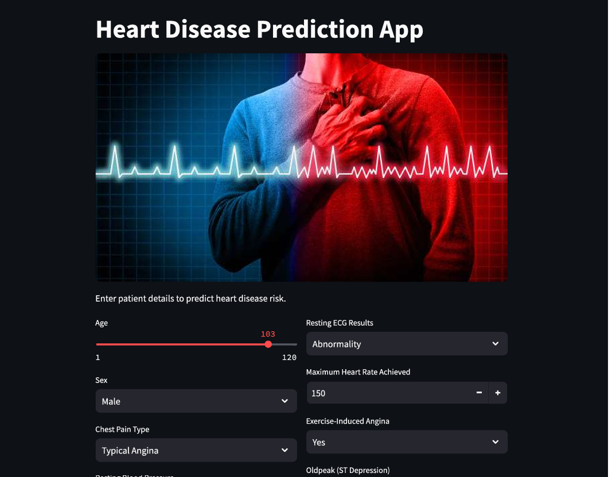

## `Heart Disease Prediction using Machine Learning – Streamlit App:`

## About the Project:
Heart disease is one of the leading causes of death worldwide.  
This project uses **machine learning** to analyze patient health data and predict whether a person is at risk of heart disease or not.

This is an interactive **Streamlit web application** that predicts the likelihood of **heart disease** based on user-provided medical parameters using a trained machine learning model.


## Live Demo (Access the model):
Open the web browser and open the below link.

**Streamlit App**: https://project-3-heart-disease.streamlit.app/ 

## Dataset:
    This dataset contains data about patient vitals and heart disease
    Features: 'age', 'sex', 'chest pain type', 'resting bp s', 'cholesterol', 'fasting blood sugar', 'resting ecg', 
                'max heart    rate', 'exercise angina', 'oldpeak', 'ST slope', 'target'
    Target: Presence of heart disease (0, 1)
## Techonlogy Used:
Tools, Library and Language 
- Python
- NumPy
- Pandas
- Matplotlib / Seaborn
- Scikit-learn
- Jupyter Notebook

## Installation:

```bash
1. Clone the repository and used the project
git clone https://github.com/Kumard8x/Project_3_Heart_Disease.git

2. Navigate the project directory
cd Project_3_Heart_Disease

3. Install requirement libraries
pip install -r requirements.txt

```

## Usage:
Run the script file and access the model locally.

```bash
streamlit run script.py
```
Enter the patient details and get the pridiction.

## ## Model Evaluation
- Accuracy
- Precision
- Recall
- F1-score

## Results
-  Random Forest Classifier accuracy: 95%

## Snapshot:


